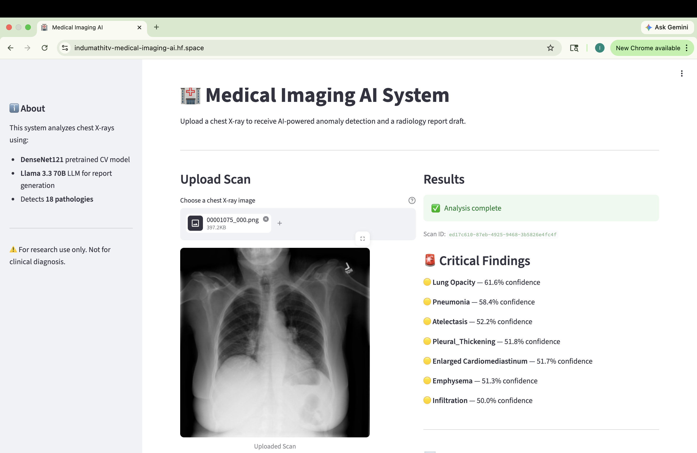

# 🏥 Medical Imaging AI System



> **AI-powered chest X-ray analysis system that detects pulmonary abnormalities and generates structured radiology reports — built with Computer Vision, LLM Agents, FastAPI, and Docker.**

🔗 **[Live Demo](https://indumathitv-medical-imaging-ai.hf.space)** | 🔗 **[GitHub](https://github.com/Indumathitv27/medical-imaging-ai)**

---

## 🧠 What does this system do?

Radiologists read 50–100 chest X-rays every single day. Each scan takes 10–15 minutes to analyze and report. Fatigue and volume lead to missed findings.

This system acts as an **AI assistant for radiologists**:

1. A chest X-ray is uploaded to the dashboard
2. The system validates and stores it with a unique scan ID
3. A pretrained **Computer Vision model** analyzes the image and detects 18 potential abnormalities with confidence scores
4. An **LLM Agent** (Llama 3.3 70B) reads those findings and drafts a structured radiology report
5. The radiologist reviews the findings and report on a live dashboard and signs off

The radiologist shifts from **discovery** to **verification** — faster, more accurate, less exhausting.

---

## 🚀 Live Demo

Try it yourself — upload any chest X-ray image:

👉 **[https://indumathitv-medical-imaging-ai.hf.space](https://indumathitv-medical-imaging-ai.hf.space)**

---

## 🏗️ System Architecture

User uploads chest X-ray
↓
FastAPI Backend
POST /analyze
↓
┌─────────────────────┐
│   Ingestion Layer   │  → Validates file, assigns UUID, stores scan
└─────────────────────┘
↓
┌─────────────────────┐
│  CV Model Layer     │  → DenseNet121 inference, 18 pathology scores
└─────────────────────┘
↓
┌─────────────────────┐
│  LLM Agent Layer    │  → Llama 3.3 70B drafts radiology report
└─────────────────────┘
↓
┌─────────────────────┐
│  Streamlit Dashboard│  → Live findings + report display
└─────────────────────┘

### ☁️ AWS Production Mapping

| Local Component | AWS Equivalent |
|---|---|
| Local filesystem | S3 (encrypted, versioned) |
| FastAPI + Uvicorn | API Gateway + Lambda / ECS |
| DenseNet121 model | SageMaker real-time endpoint |
| Groq Llama 3.3 70B | Amazon Bedrock |
| Streamlit dashboard | CloudFront + React |
| logs/ folder | CloudWatch Logs |
| Docker container | ECR + ECS Fargate |

---

## 🛠️ Tech Stack

| Layer | Technology |
|---|---|
| Computer Vision | TorchXRayVision, DenseNet121, PyTorch |
| LLM Agent | Groq API, Llama 3.3 70B, LangChain |
| Backend API | FastAPI, Uvicorn, Python 3.10 |
| Frontend | Streamlit |
| Containerization | Docker |
| Deployment | Hugging Face Spaces |
| Dataset | NIH ChestX-ray14 (112,000+ chest X-rays) |
| Cloud Design | AWS (S3, SageMaker, Bedrock, CloudFront) |

---

## 🔬 Detected Pathologies (18 total)

The DenseNet121 model detects the following chest pathologies with confidence scores:

| Pathology | Pathology | Pathology |
|---|---|---|
| Atelectasis | Cardiomegaly | Consolidation |
| Edema | Effusion | Emphysema |
| Fibrosis | Fracture | Hernia |
| Infiltration | Lung Lesion | Lung Opacity |
| Mass | Nodule | Pleural Thickening |
| Pneumonia | Pneumothorax | Enlarged Cardiomediastinum |

---

## 📋 Sample Output

**Critical Findings detected:**
- 🔴 Lung Opacity — 97.7% confidence
- 🟡 Lung Lesion — 93.3% confidence
- 🟡 Cardiomegaly — 59.1% confidence

**AI Draft Radiology Report (excerpt):**
> *"The scan reveals a highly suspicious lung opacity with confidence of 97.7%. Lung lesion is also highly suspected at 93.3%. Correlation with clinical symptoms and further evaluation via CT is recommended..."*

---

## 🗂️ Project Structure
medical-imaging-ai/
├── ingestion/              # Image validation, UUID assignment, audit logging
│   ├── init.py
│   └── ingest.py
├── cv_model/               # DenseNet121 inference pipeline
│   ├── init.py
│   └── predict.py
├── agent/                  # LLM report generation agent
│   ├── init.py
│   └── report_agent.py
├── api/                    # FastAPI backend
│   ├── init.py
│   └── main.py
├── dashboard/              # Streamlit frontend
│   └── app.py
├── data/
│   ├── raw/                # Uploaded scans (gitignored)
│   └── processed/          # Model outputs
├── logs/                   # Audit logs — ingestion, model, agent, api
├── project_config.py       # Centralized configuration
├── requirements.txt        # All dependencies
├── Dockerfile              # Container definition
└── .env                    # API keys (never committed)

---

## ⚙️ How to Run Locally

### Prerequisites
- Python 3.10+
- Conda
- Groq API key — free at [console.groq.com](https://console.groq.com)

### Setup

```bash
# Clone the repo
git clone https://github.com/Indumathitv27/medical-imaging-ai.git
cd medical-imaging-ai

# Create conda environment
conda create -n medical-imaging python=3.10
conda activate medical-imaging

# Install all dependencies
pip install -r requirements.txt

# Add your Groq API key
echo "GROQ_API_KEY=your_key_here" > .env
```

### Run

```bash
# Terminal 1 — Start FastAPI backend
uvicorn api.main:app --reload --host 0.0.0.0 --port 8000

# Terminal 2 — Start Streamlit dashboard
streamlit run dashboard/app.py
```

Open your browser at **http://localhost:8501**

### Docker

```bash
docker build -t medical-imaging-ai .
docker run -p 7860:7860 -e GROQ_API_KEY=your_key_here medical-imaging-ai
```

---

## 🔒 Production Design Decisions

**HIPAA-ready audit logging** — Every scan ingestion, model inference, and report generation is logged with timestamp and scan ID. No PHI is stored in logs.

**Human-in-the-loop** — The system never replaces the radiologist. Every report is marked as an AI draft pending radiologist review and approval.

**Modular architecture** — Each layer (ingestion, CV model, LLM agent, API, dashboard) is a separate independent module. Any layer can be swapped or scaled independently without touching the others.

**Environment-based configuration** — All settings live in `project_config.py`. Storage, ports, and API endpoints are configurable — switching from local filesystem to S3 requires changing 2 lines.

**Confidence-based clinical reasoning** — The LLM agent interprets confidence scores clinically: above 70% is flagged as highly suspicious, 50–70% as moderate suspicion requiring clinical correlation.

---

## 📊 Dataset

**NIH ChestX-ray14** — Released by the US National Institutes of Health specifically for AI research.
- 112,000+ frontal chest X-rays
- 30,000+ de-identified patients
- 14 disease labels with bounding box annotations
- Completely free and open for research use

Download: [NIH Box](https://nihcc.app.box.com/v/ChestXray-NIHCC)

---

## ⚠️ Disclaimer

This system is for **research and educational purposes only**. It is not intended for clinical diagnosis or medical decision-making. All AI-generated reports must be reviewed and approved by a qualified radiologist before any clinical use.

---

## 👩‍💻 Author

**Indumathi Tamil Selvi Varadharajan**
M.S. Data Science — University at Buffalo (GPA 3.8)
Data Engineer | AI/ML Enthusiast

[](https://linkedin.com/in/indumathitv2702/)
[](https://github.com/Indumathitv27/)
[](https://indumathitv-medical-imaging-ai.hf.space)

---

*Built with Python, PyTorch, FastAPI, Streamlit, Groq API, and Docker. Deployed on Hugging Face Spaces.*